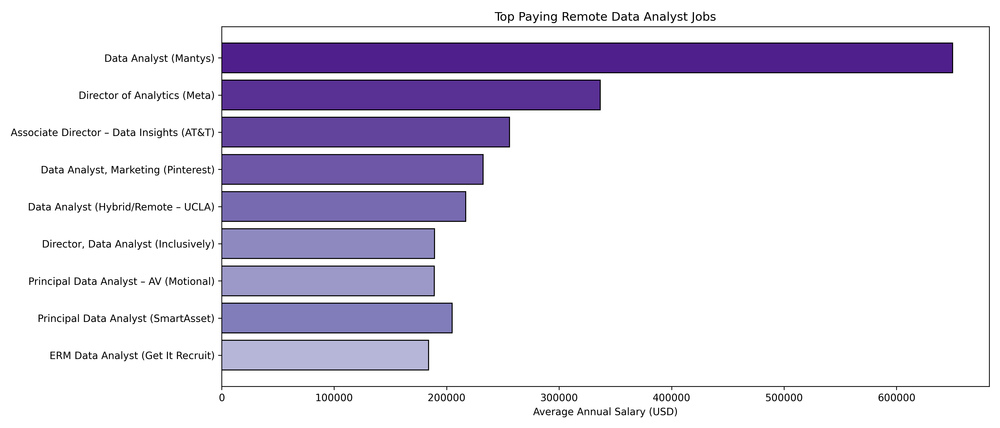

# SQL Data Analyst Job Market Analysis 📊

---

## Introduction
This project analyzes the Data Analyst job market using SQL to uncover insights related to salaries, skill demand, and optimal skill combinations. The objective is to transform real-world job posting data into actionable insights that can guide career decisions for aspiring and experienced data analysts.

The analysis focuses specifically on remote (work-from-home) Data Analyst roles and examines how compensation varies with job titles, required skills, and market demand.

---

## Background
The rapid growth of data-driven decision-making has increased demand for data analysts across industries. However, not all roles and skills offer the same career and salary outcomes. Many job seekers face uncertainty around:
- Which data analyst roles pay the most?
- Which skills are most in demand?
- Which skills offer the best balance of demand and salary?

This project addresses these questions by analyzing structured job posting data stored in a PostgreSQL database using SQL-based analysis.

---

## Tools I Used
- **PostgreSQL** – Relational database used to store and query job posting data  
- **SQL** – Used for joins, CTEs, aggregations, filtering, and ordering  
- **VS Code + SQLTools** – SQL development environment and database connectivity  
- **Git & GitHub** – Version control and project documentation  

---

## The Analysis

### 1. What are the top paying Data Analyst jobs?

#### SQL Query
```sql
SELECT
    jp.job_id,
    jp.job_title,
    jp.job_location,
    jp.job_schedule_type,
    jp.salary_year_avg,
    jp.job_posted_date,
    cd.name AS company_name
FROM job_postings_fact jp
LEFT JOIN company_dim cd
    ON jp.company_id = cd.company_id
WHERE 
    jp.job_title_short = 'Data Analyst'
    AND jp.job_location = 'Anywhere'
    AND jp.salary_year_avg IS NOT NULL
ORDER BY jp.salary_year_avg DESC
LIMIT 10;
```

*Bar grapgh vizualizing the salary for the top 10 salaries for data analysts*

**Key Insights**

- Salaries range from approximately $184,000 to $650,000.
- Senior and leadership roles (Principal, Director, Associate Director) dominate top-paying positions.
- All top-paying roles are full-time remote, indicating strong compensation parity for remote work.
---

### 2. What skills are required for these top-paying roles?
#### SQL Query
```sql
WITH top_paying_jobs AS (
SELECT
    jp.job_id,
    jp.job_title,
    jp.salary_year_avg,
    cd.name AS company_name
FROM
    job_postings_fact jp
LEFT JOIN company_dim cd
ON jp.company_id = cd.company_id
WHERE 
    jp.job_title_short = 'Data Analyst' AND
    jp.job_location = 'Anywhere' AND
    jp.salary_year_avg IS NOT NULL
ORDER BY
    jp.salary_year_avg DESC
LIMIT 10
)
SELECT 
    tpj.* ,
    Skills
FROM top_paying_jobs tpj
INNER JOIN skills_job_dim sj
ON tpj.job_id = sj.job_id
INNER JOIN skills_dim sd
ON sj.skill_id = sd.skill_id
ORDER BY tpj.salary_year_avg DESC
```


*Bar Graph Vizualizing the count of skills for the top 10 paying jobs for data analyst.*

**Key Insights**

- SQL appears in every top-paying role.
- Python is the second most frequently required skill.
- Data visualization tools such as Tableau and Power BI are consistently required.
- Senior roles demand exposure to cloud platforms (AWS, Azure) and big-data tools (Databricks, PySpark).
---

### 3. What are the most in-demand skills for Data Analysts?
#### SQL Query
```sql
SELECT 
    sd.skills,
    COUNT(sj.skill_id) AS demand_count
FROM job_postings_fact jp
INNER JOIN skills_job_dim sj
ON jp.job_id = sj.job_id
INNER JOIN skills_dim sd
ON sj.skill_id = sd.skill_id
WHERE 
    jp.job_title_short = 'Data Analyst' AND
    jp.job_work_from_home = 'True'
GROUP BY
    sd.skills
ORDER BY
    demand_count DESC
LIMIT 5
```
| Rank | Skill    | Demand Count |
| ---- | -------- | ---------------------- |
| 1    | SQL      | 7,291                  |
| 2    | Excel    | 4,611                  |
| 3    | Python   | 4,330                  |
| 4    | Tableau  | 3,745                  |
| 5    | Power BI | 2,609                  |

*Table of the demand for the top 5 skills in data analyst job postings*

**Key Insights**
- SQL is the most in-demand skill across the job market.
- Excel remains highly relevant despite newer technologies.
- Python demand reflects its importance in automation and advanced analytics.
- Visualization tools are essential for communicating insights
---

### 4. What are the top skills based on salary?
#### SQL Query
```sql
SELECT 
    sd.skills,
    ROUND(AVG(jp.salary_year_avg), 0) AS average_salary
FROM job_postings_fact jp
INNER JOIN skills_job_dim sj
ON jp.job_id = sj.job_id
INNER JOIN skills_dim sd
ON sj.skill_id = sd.skill_id
WHERE 
    jp.job_title_short = 'Data Analyst'  
    AND jp.salary_year_avg IS NOT NULL
    AND jp.job_work_from_home = 'True'
GROUP BY
    sd.skills
ORDER BY
    average_salary DESC
LIMIT 25       
```

| Rank | Skill         | Average Salary (USD) |
| ---: | ------------- | -------------------- |
|    1 | PySpark       | $208,172             |
|    2 | Bitbucket     | $189,155             |
|    3 | Couchbase     | $160,515             |
|    4 | Watson        | $160,515             |
|    5 | DataRobot     | $155,486             |
|    6 | GitLab        | $154,500             |
|    7 | Swift         | $153,750             |
|    8 | Jupyter       | $152,777             |
|    9 | Pandas        | $151,821             |
|   10 | Elasticsearch | $145,000             |

*Table of the average salary for the top 10 paying skills for data analysts*

**Key Insights**
- Big-data and distributed processing skills command the highest salaries.
- PySpark leads with the highest average salary.
- Engineering and DevOps-related tools (GitLab, Jenkins, Kubernetes) correlate strongly with higher pay.
- Core Python tools provide strong value but plateau without cloud or big-data integration.

### 5. What are the most optimal skills to learn? (High Demand + High Pay)
#### SQL Query
```sql
WITH skills_demand AS (
    SELECT 
        sd.skill_id,
        sd.skills,
        COUNT(sj.skill_id) AS demand_count
    FROM job_postings_fact jp
    INNER JOIN skills_job_dim sj
        ON jp.job_id = sj.job_id
    INNER JOIN skills_dim sd
        ON sj.skill_id = sd.skill_id
    WHERE 
        jp.job_title_short = 'Data Analyst'
        AND jp.salary_year_avg IS NOT NULL
        AND jp.job_work_from_home = 'True'
    GROUP BY
        sd.skill_id,
        sd.skills
),
average_salary AS ( 
    SELECT 
        sd.skill_id,
        sd.skills,
        ROUND(AVG(jp.salary_year_avg), 0) AS average_salary
    FROM job_postings_fact jp
    INNER JOIN skills_job_dim sj
        ON jp.job_id = sj.job_id
    INNER JOIN skills_dim sd
        ON sj.skill_id = sd.skill_id
    WHERE 
        jp.job_title_short = 'Data Analyst'
        AND jp.salary_year_avg IS NOT NULL
        AND jp.job_work_from_home = 'True'
    GROUP BY
        sd.skill_id,
        sd.skills
)

SELECT 
    sd.skill_id,
    sd.skills,
    sd.demand_count,
    av.average_salary
FROM skills_demand sd
INNER JOIN average_salary av
    ON sd.skill_id = av.skill_id
WHERE sd.demand_count >= 10
ORDER BY
    av.average_salary DESC,
    sd.demand_count DESC
   
LIMIT 25;

-- rewriting the same query more concisely

SELECT 
    sd.skill_id,
    sd.skills,
    COUNT(sd.skill_id) AS demand_count,
    ROUND(AVG(jp.salary_year_avg), 0) AS average_salary
FROM job_postings_fact jp
INNER JOIN skills_job_dim sj
    ON jp.job_id = sj.job_id    
INNER JOIN skills_dim sd
    ON sj.skill_id = sd.skill_id        
WHERE 
    jp.job_title_short = 'Data Analyst'
    AND jp.salary_year_avg IS NOT NULL
    AND jp.job_work_from_home = 'True'
GROUP BY
    sd.skill_id
HAVING
    COUNT(sd.skill_id) >= 10
ORDER BY
    average_salary DESC,
    demand_count DESC
LIMIT 25;
```

| Rank | Skill       | Demand Count | Average Salary (USD) |
| ---: | ----------- | ------------ | -------------------- |
|    1 | Databricks  | 10           | $141,907             |
|    2 | Go (Golang) | 27           | $115,320             |
|    3 | Confluence  | 11           | $114,210             |
|    4 | Hadoop      | 22           | $113,193             |
|    5 | Snowflake   | 37           | $112,948             |
|    6 | Azure       | 34           | $111,225             |
|    7 | BigQuery    | 13           | $109,654             |
|    8 | AWS         | 32           | $108,317             |
|    9 | Java        | 17           | $106,906             |
|   10 | SSIS        | 12           | $106,683             |

*Table of most optimal skills for data analyst sorted by salary*

**Key Insights**

- Databricks stands out as the most optimal skill, offering the highest average salary ($141K+) even with moderate demand—highlighting the premium placed on modern data platforms.
- Cloud technologies dominate the optimal skill set, with AWS, Azure, and BigQuery consistently combining strong demand (30+ postings) with six-figure salaries.
- Big-data and distributed systems skills such as Snowflake and Hadoop deliver high compensation, signaling a market shift toward analysts who work at scale.
- Foundational programming and enterprise tools (Go, Java, SSIS, Confluence) remain highly valued when paired with cloud or data-engineering workflows.
- The strongest career leverage comes from skill combinations, where core analytics (SQL/Python) are augmented by cloud, big-data, and platform expertise rather than used in isolation.

---


## What I Learned
Through this project, I learned how to:
- Design multi-table SQL queries using fact and dimension tables.
- Use CTEs to structure complex analytical queries.
- Analyze salary and demand together to generate meaningful insights.
- Translate raw data into clear, business-focused conclusions.
- Present analytical work professionally on GitHub.

---

## Conclusions
- **Data Analyst compensation is highly concentrated at senior levels.**
Remote data analyst salaries in the top tier range from $184,000 to $650,000, with the highest pay consistently associated with Principal, Director, and Associate Director roles.

- **SQL is the single most important skill in the market.**
SQL appears in 100% of top-paying roles and is the most in-demand skill overall, with 7,291 job postings, making it a mandatory foundation for career growth.

- **High demand skills are not always the highest paying.**
Tools such as Excel (4,611 postings) and Tableau (3,745 postings) are widely required but deliver lower average salaries compared to specialized cloud and big-data technologies.

- **Big-data and cloud skills command the strongest salary premiums.**
Skills like PySpark ($208K avg.), Databricks ($142K), and Snowflake ($113K) significantly outperform traditional analytics tools in compensation.

- **The optimal career strategy combines analytics with engineering exposure.**   
Analysts who pair SQL, Python, and visualization tools with cloud platforms and modern data architectures achieve the best balance of market demand and salary potential.
---

## Closing Thoughts

This project strengthened my SQL capabilities while providing clear, data-backed insights into the data analyst job market. The analysis demonstrates that long-term career growth is driven not only by mastering foundational skills, but by strategically prioritizing high-impact, high-salary tools aligned with modern data ecosystems. By identifying the intersection of demand, compensation, and specialization, this project offers a practical framework for focusing skill development and job search efforts. Overall, the findings highlight the importance of continuous learning and adapting to emerging technologies as the data analyst role increasingly overlaps with cloud, big-data, and engineering-oriented responsibilities.